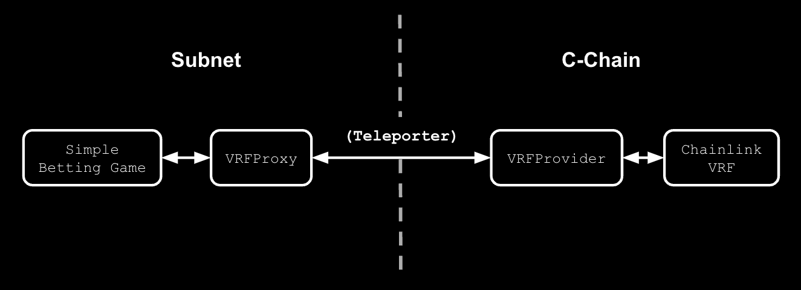

# Subnet VRF Contracts

This repository provides **example** contracts for how an Avalanche Subnet could leverage [Chainlink VRF](https://docs.chain.link/vrf) functionality (available on the C-Chain) using [Teleporter](https://github.com/ava-labs/teleporter). This allows newly launched Subnets to immediately utilize VRF without any trusted intermediaries or third-party integration requirements.

**The contracts in this repository are not audited and are not suitable for production use.**

## Contracts
There are 2 primary contracts (`VRFProxy` and `VRFProvider`) that enable the use of VRF on Subnets. This repository also includes a `SimpleBettingGame` contract to demostrate possible usage of VRF.


<div align="center">
  
</div>

### VRFProvider
The `VRFProvider` contract is intended to be deployed on the same chain that Chainlink VRF is available on (i.e. the C-Chain). It is configured to receive randomness requests from a specific `VRFProxy`, and passes those requests on to the Chainlink VRF coordinator. When the random values are provided by the Chainlink VRF coordinator, the `VRFProvider` in turn sends those values back to the `VRFProxy` that requested them via Teleporter.

In order be able to successfully request random values from the configured Chainlink VRF coordinator, the `VRFProvider` must be added to a [VRF subscription as an allowed consumer](https://docs.chain.link/vrf/v2/subscription/ui). The `VRFProvider` contract exclusively uses the [subscription method](https://docs.chain.link/vrf/v2/subscription) for paying fees the randomness requests.

### VRFProxy
The `VRFProxy` contract is intended to be deployed on any Subnet chain that would like to leverage Chainlink VRF but does not have a direct VRF integration. It is configured to request values from a specific `VRFProvider` that is deployed on another chain via Teleporter. It provides the same `requestRandomWords` interface as Chainlink VRF coordinators, and returns random values to fulfill requests via the same `fulfillRandomWords` method used by Chainlink VRF consumers.

In order to be able to request random values from a `VRFProxy`, accounts must be added as allowed consumers via `addConsumer`.

### SimpleBettingGame
A sample contract demostrating the use of VRF. Implements a simple betting game that leverages a `VRFProxy` to fulfill random values.

## VRF Application Contract Compatibility
Any contracts currently using Chainlink VRF to request random values on the C-Chain should also be directly compatible with the `VRFProxy` contract. The `VRFProxy` implements the same `requestRandomWords` interface method of `VRFCoordinatorV2`, so no changes should be needed.

## Dependencies
In order to build and deploy the contracts using the scripts in this repository, [Foundry](https://book.getfoundry.sh/getting-started/installation) is required. It can be installed using:
```bash
./scripts/install_foundry.sh
```

## Building and Testing
The contracts in this repository can be built and tested using the following scripts.
```bash
./scripts/build.sh
./scripts/test.sh
```
Included in the unit test script is a test coverage report.
```
| File                      | % Lines         | % Statements    | % Branches      | % Funcs         |
|---------------------------|-----------------|-----------------|-----------------|-----------------|
| src/GasUtils.sol          | 100.00% (7/7)   | 100.00% (4/4)   | 100.00% (3/3)   | 100.00% (1/1)   |
| src/SimpleBettingGame.sol | 100.00% (38/38) | 100.00% (42/42) | 100.00% (22/22) | 100.00% (6/6)   |
| src/VRFProvider.sol       | 100.00% (12/12) | 100.00% (15/15) | 100.00% (8/8)   | 100.00% (2/2)   |
| src/VRFProxy.sol          | 100.00% (25/25) | 100.00% (29/29) | 100.00% (14/14) | 100.00% (4/4)   |
| Total                     | 100.00% (82/82) | 100.00% (90/90) | 100.00% (47/47) | 100.00% (13/13) |
```

## Deploying
The example contracts can be deployed by running.
```bash
./scripts/deploy.sh
```
The deployment script requires setting proper environment variable values in the `.env`. This can be done using:
```bash
cp .env.example .env
```
The `user_private_key` value then must be set in the `.env` file. The full list of configurable environment variables includes:
| Environment Variable | Description |
|--------|--------|
| c_chain_url | RPC endpoint for the C-Chain (where Chainlink VRF is available) |
| c_chain_blockchain_id | Blockchain ID of the C-Chain (hexadecimal encoded) |
| c_chain_teleporter_registry_address | Teleporter registry contract used by the `VRFProvider` on the C-Chain | 
| c_chain_vrf_coordinator_address | Address of the Chainlink VRF Coordinator to be used by the `VRFProvider` |
| c_chain_vrf_subscription_id | The Chainlink VRF subscription ID to be used by the `VRFProxy` |
| c_chain_vrf_key_hash | The Chainlink VRF key hash to be used by the `VRFProxy` |
| subnet_url | RPC endpoint for the Subnet chain to be used|
| subnet_blockchain_id | Blockchain ID of the Subnet chain to be used (hexadecimal encoded) |
| subnet_teleporter_registry_address | Teleporter registry contract used by the `VRFProvider` on the Subnet chain |
| user_private_key | Private key for a funded account on both the C-Chain and Subnet chain. Used to deploy contracts |

## Interacting
Once the contracts are deployed to their respective blockchains, an example flow to properly interact with them is as follows:

1. Adding the `VRFProvider` contract as an [allowed consumer of the Chainlink VRF subscription](https://vrf.chain.link/fuji) used by the contracts on the C-Chain.
2. Adding the `SimpleBettingGame` contract as an allowed consumer of the `VRFProxy` contract on the Subnet. For example:
```
cast send <vrf_proxy_contract_address> "addConsumer(address)" <simple_betting_game_contract_address> --rpc-url <subnet_url> --private-key <user_private_key>
```
3. Placing and taking bets! Done by calling `proposeBet` and `takeBet` functions of the `SimpleBettingGame` contract.

Example instances of the three contracts have been deployed and configured at the following addresses on the [Fuji C-Chain](https://subnets-test.avax.network/c-chain) and [Dispatch Subnet](https://subnets-test.avax.network/dispatch).

* [`VRFProvider` on the C-Chain](https://subnets-test.avax.network/c-chain/address/0x08bBe2Dc39c450803AE27A29c1Ec7494EF41aeF1)
* [`VRFProxy` on Dispatch](https://subnets-test.avax.network/dispatch/address/0x067606899F55eC607D689929FB643f86DE10D513)
* [`SimpleBettingGame` on Dispatch](https://subnets-test.avax.network/dispatch/address/0xF800569A4dD2E0FE214c30469Edf1aAa1373bc82)

Bets can be placed and taken on Dispatch using the following commands. Note that bets must be taken from a different account than they were placed by.
```bash
Place Bet:

cast send 0xF800569A4dD2E0FE214c30469Edf1aAa1373bc82 "proposeNewBet(uint32)(uint256)" <max_value> --rpc-url https://subnets.avax.network/dispatch/testnet/rpc --private-key <user_private_key>

Take Bet:

cast send 0xF800569A4dD2E0FE214c30469Edf1aAa1373bc82 "takeBet(uint256)" <bet_id> --rpc-url https://subnets.avax.network/dispatch/testnet/rpc --private-key <user_private_key>

```
